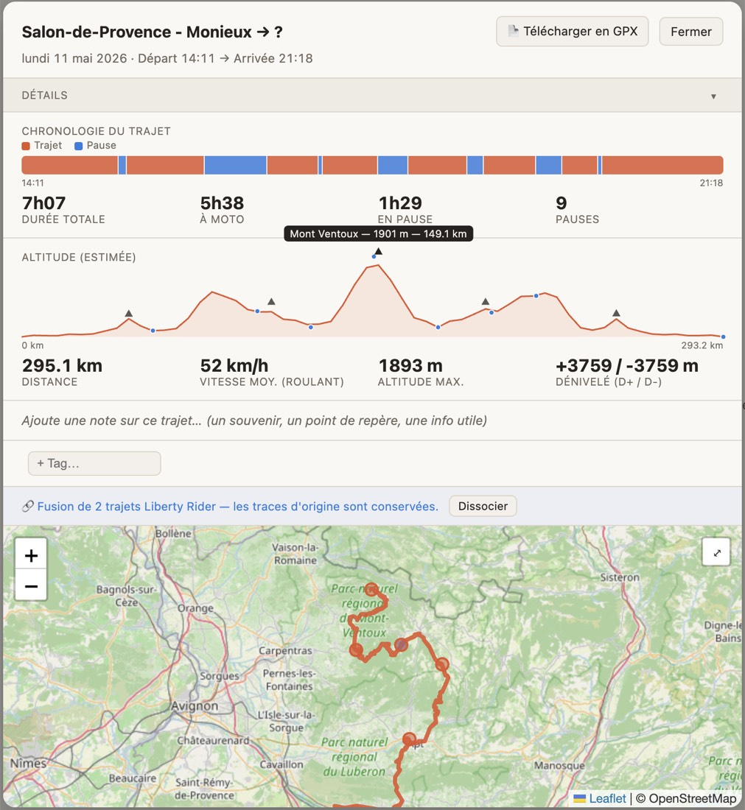
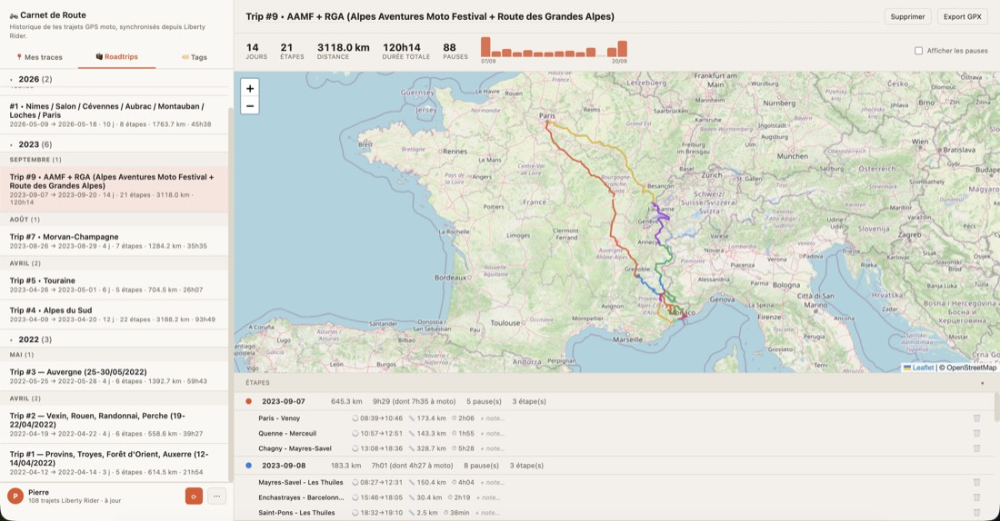
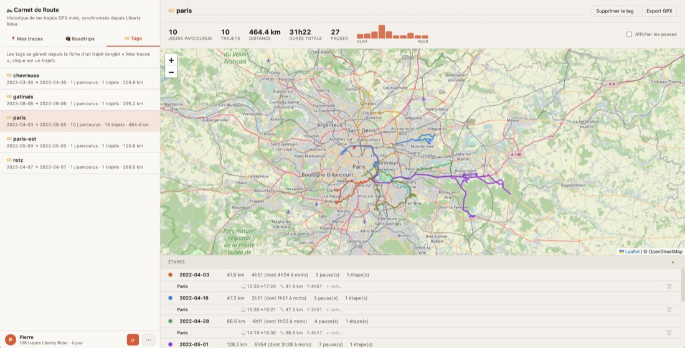

# Carnet de Route

**Your Liberty Rider ride history, finally visible** — every ride you ever
started and stopped, grouped into roadtrips, tagged by place, and put on a
map.

[](https://github.com/tekncoach/liberty-rider-myroadtrips/actions/workflows/ci.yml)
[](https://github.com/tekncoach/liberty-rider-myroadtrips/actions/workflows/codeql.yml)
[](pyproject.toml)
[](LICENSE)

[**Live demo**](https://liberty-rider-myroadtrips.exe.xyz) (log in with your
own Liberty Rider account) · [Screenshots](#screenshots) ·
[Architecture](docs/ARCHITECTURE.md) · [Security policy](SECURITY.md)

A self-hosted, multi-user tool for organizing your personal ride history
from the [Liberty Rider](https://liberty-rider.com/) motorcycle app.
Liberty Rider's own web app only shows the "roadbooks" you explicitly
published; the raw history — the "Trajets" tab of the mobile app, every
ride you started and stopped — has no web view at all. This tool syncs
that history into a database and gives you a map-based UI to group rides
into multi-day roadtrips, tag them by geographic zone, and clean up
tracking artifacts like a single ride getting split in two.

Independent, unofficial project — not affiliated with, endorsed by, or
sponsored by Liberty Rider. "Liberty Rider" is a trademark of its own
owners.

Each account is scoped to its own data — logging in with your Liberty Rider
email/password only ever shows *your* rides, never anyone else's, whether
you're running this for yourself or hosting it for a few people.

## Features

- **Sync** — pulls your full ride history (or just what's new) from Liberty
  Rider's GraphQL API into a database — SQLite for local/single-user use,
  or Postgres for a hosted deployment (see [How it works](#how-it-works)).
- **Roadtrips** — manually group rides into named, multi-day trips, with a
  collapsible day-by-day breakdown and a km/day histogram (rest days show
  as visible gaps).
- **Tags** — many-to-many labels for geographic zones (e.g. "Paris"),
  independent of any date range, so a place you keep passing through can
  accumulate rides over time.
- **Merge** — non-destructively combines two rides that got tracking-split
  into one back into a single logical ride; raw rows are never deleted, so
  a merge can be undone at any time. Same-day, near-zero-gap pairs are
  automatically flagged as merge candidates.
- **Ride chronology** — a trajet/pause timeline per ride, each segment
  sized by its real duration, built from Liberty Rider's own pause/resume
  events (a field the app requests but never used to store).
- **Estimated elevation profile** — Liberty Rider has no altitude-per-point
  data anywhere; this app estimates one via the free
  [open-elevation](https://www.open-elevation.com/) API (cached forever
  per coordinate) and derives D+/D- and average moving speed from it.
- **Named cols & summits** — detects the ride's own local elevation peaks
  (by shape, not absolute altitude) and looks up a name for each via
  OpenStreetMap's Overpass API — a through-route col (e.g. *Col du
  Tourmalet*) or a dead-end summit (e.g. *Mont Ventoux*) alike. Found
  names are persisted per ride, so they become searchable over time.
- **Notes & search** — a free-text note per ride, and a search box in "Mes
  traces" (title, note, and any discovered col names), accent-insensitive,
  entirely client-side.
- **Map view** — every ride, roadtrip, and tag rendered on a Leaflet /
  OpenStreetMap map, color-coded per day, with ride preview thumbnails
  pulled from Liberty Rider's own static tile server.
- **GPX export** — download any ride, roadtrip, or tag as a GPX file.
- **Public share link** — opt one ride into an unguessable URL that anyone
  can open without an account (a map of the track plus the basic stats,
  nothing else about you). Off by default, one ride at a time, revocable,
  and re-issuable with a fresh token that kills the old link. The first and
  last 250 m of the track are trimmed off before it leaves the server, so
  the link doesn't hand out your front door.

## Data & external services

Besides Liberty Rider's own (undocumented) API, two free public services
are used, only ever sent a ride's GPS coordinates (never any account
info):

- **[open-elevation.com](https://www.open-elevation.com/)** — estimates
  altitude for points along a ride's track. Every coordinate looked up is
  cached forever (`elevation_cache` table) so it's never queried twice.
- **[Overpass API](https://overpass-api.de/)** (OpenStreetMap) — looks up
  the name of a col/summit near a detected elevation peak. Also cached
  forever (`mountain_pass_cache`), including a "nothing named nearby"
  result, so a transient failure is *not* cached — only a completed query
  is (see `mountain_pass.py`).

Both are free, keyless, and rate-limited — expect the elevation chart and
col names to sometimes take a moment on a ride you haven't opened before,
especially over a long or previously-unseen track. Neither is required for
the app to work; both fail silently if unavailable.

## Security & your data

This app holds credentials to a third-party account and a year's worth of
where you have been, so it is worth being explicit about what it keeps.

- **Your password is never stored.** It is sent once to Firebase — the
  identity provider Liberty Rider's own web app uses — and exchanged for
  tokens.
- **Those tokens are stored**, in the same database as your rides (the
  SQLite file or Postgres), so syncing doesn't ask for your password
  again — and they are **encrypted at rest** when `TOKEN_ENCRYPTION_KEY`
  is set, with a key kept outside the database (see
  [docs/TOKEN-ENCRYPTION.md](docs/TOKEN-ENCRYPTION.md)). Without that
  variable they are stored in clear, which is fine for a local instance and
  worth weighing before hosting this for other people. Logging out of your
  last session deletes them.
- **Sessions expire** server-side and are purged; every ride, roadtrip and
  tag row is scoped to your Liberty Rider user id, and every API request
  is checked against it.
- **Your rides don't leave the host**, other than as bare GPS coordinates
  sent to the two public services described above — never with an account,
  an email or a ride id attached.
- **Deleting everything**: on a deployment you don't run yourself, ask the
  operator (the purge endpoint is maintainer-only by design). On your own
  instance, the whole dataset is one SQLite file or one Postgres database
  — drop it.
- **Found a vulnerability?** See [SECURITY.md](SECURITY.md). Please don't
  open a public issue for it.

## Screenshots

Ride detail — trajet/pause timeline, estimated elevation profile with named
cols, map, notes and tags:



A roadtrip — multiple rides grouped into one trip, with a per-day km
histogram and every day's track color-coded on one map:



A tag — rides collected by place or theme, independent of any date range:



## Requirements

- Python 3.11+ — what CI actually runs the suite against (3.11, 3.12 and
  3.13). The only hard floor in the code itself is 3.10 (`X | Y` union
  types at runtime, not just in annotations), but nothing verifies that.
- A Liberty Rider account with some ride history
- Postgres, only if deploying for more than yourself (see below) — plain
  SQLite is used automatically otherwise, no setup needed

## Setup

```bash
make install
make run
```

Then open **http://127.0.0.1:8420** and log in with your Liberty Rider
email and password — that's it. There's no separate token to fetch or paste;
the app exchanges your credentials directly with Firebase (the same
identity provider Liberty Rider's own web app uses) and keeps a session for
you from then on. Your password is never stored — only the resulting
tokens are; see [Security & your data](#security--your-data) for what that
means exactly.

Once logged in, click **Synchroniser** to pull your ride history in, then
**Full sync** any time you want to re-walk the entire history instead of
just what's new.

### Running this for more than one person

Every account is fully isolated (its own rides/roadtrips/tags, scoped by
your Liberty Rider user id) — logging in just works for anyone with a
Liberty Rider account, no per-user setup needed. For a real hosted
deployment (not just `127.0.0.1`), set:

```bash
export DATABASE_URL=postgres://...   # switches the backend from SQLite to Postgres
export COOKIE_SECURE=1               # only send the session cookie over HTTPS
```

and put a real HTTPS reverse proxy in front of it — the app itself doesn't
terminate TLS. A single-file SQLite database works fine for one person on
their own machine, but isn't a good fit for a multi-user host (concurrent
writes, no separate backup story) — see `docs/ARCHITECTURE.md`.

## How it works

- **Backend**: FastAPI, no ORM — see `app.py`, `db.py`, `sync.py`. `db.py`
  picks its backend from `DATABASE_URL`: unset uses a local SQLite file
  (`data/rides.db`, gitignored); set, it uses Postgres via `psycopg`
  instead — same SQL (`?`-style placeholders throughout), translated
  underneath, see `db.py`'s module docstring. Ride data is fetched via a
  small GraphQL client (`liberty_client.py`) and upserted into whichever
  backend is active.
- **Frontend**: a single-page vanilla-JS app (`static/index.html`,
  `static/app.js`) using Leaflet for mapping, with no build step.
- **Auth**: one method — email + password, exchanged directly with
  Firebase (`firebase_refresh.py`). On success the app looks up your
  Liberty Rider user id (`currentUser.id` — the same id Liberty Rider
  itself uses) and creates a `users` row keyed by it, plus a session
  cookie. Every ride/roadtrip/tag row is scoped to that id, and every
  request needs a valid session — see `docs/ARCHITECTURE.md`.

## Disclaimer

This is an independent, unofficial, community-built project. It is **not
affiliated with, endorsed by, sponsored by, or in any way officially
connected to Liberty Rider**, or any of its subsidiaries or affiliates. The
name "Liberty Rider" and any related names, marks, emblems, and images are
registered trademarks of their respective owners. The official Liberty
Rider app and website are at **[liberty-rider.com](https://liberty-rider.com/)**.

This project talks to an **undocumented, reverse-engineered** Liberty Rider
API that was not designed or published for third-party use. It may break at
any time if Liberty Rider changes their API, without notice. Use it at your
own risk, against your own account, in accordance with Liberty Rider's own
Terms of Service.

## License

MIT License — see [LICENSE](LICENSE).

## A note on how this was built

This project was built collaboratively with [Claude](https://www.anthropic.com/claude), Anthropic's AI assistant.
